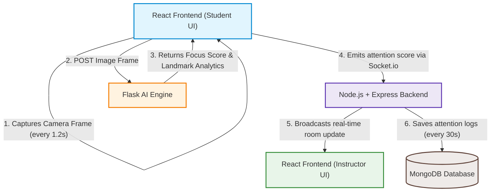

# FocusLens 🔍👁️

FocusLens is an AI-powered real-time attention tracking and classroom analytics platform for online learning. It leverages computer vision at the student's endpoint to analyze engagement metrics (such as eye gaze, head pose, blink rates, and active screen time) and streams real-time attention analytics to instructors during live WebRTC-powered virtual classes. The platform also stores historical logs to generate post-session reports, enabling instructors to optimize curriculum delivery and recognize student engagement patterns.

---

## 🚀 System Architecture

FocusLens is structured as a decoupled three-tier application:



1. **Frontend (Client)**: Built in React and Vite. It manages live video and audio sharing using WebRTC peer-to-peer connections and handles real-time Socket.io signaling.
2. **AI/ML Engine (Flask)**: Runs a lightweight Python Flask server. It takes frames uploaded by the student client, processes them using MediaPipe FaceMesh and OpenCV, and computes attention metrics.
3. **Backend API (Node.js & Socket.io)**: Controls session persistence, user authentications, database logging to MongoDB, and WebRTC signaling routing.

---

## ✨ Features

- **Real-Time Attention Tracking**: Analyzes student focus scores from 0-100% using computer vision metrics.
- **Biometric Landmark Analysis**:
  - **Head Pose Estimation**: Checks if the student is looking Center, Left, Right, Up, or Down.
  - **Eye Gaze Vectoring**: Calculates focal direction relative to the screen.
  - **Blink Rate Monitoring**: Uses Eye Aspect Ratio (EAR) to detect drowsiness and blinks.
  - **Screen Time Tracker**: Estimates active engagement duration.
- **WebRTC Videoconferencing**: Full virtual classroom support with high-definition audio/video feeds, custom pin toggling, and instructor-controlled screen sharing.
- **Instructor Dashboard**: Real-time monitor displaying active student attention bars, media indicators (mic/camera status), and instant attention drop notifications.
- **Analytical Reports**: Post-meeting dashboards featuring class averages, student breakdowns, and visual chronological logs of user engagement.
- **Security & Authorization**: Rolled access (Instructor vs Student) authenticated via JSON Web Tokens (JWT) and hashed passwords.

---

## 🛠️ Tech Stack

| Tier | Component | Technology / Library |
| :--- | :--- | :--- |
| **Frontend** | Framework & Bundler | React 19, Vite 8, React Router DOM 7 |
| | API Communications | Axios, Socket.io-Client 4 |
| | Design & Icons | Custom CSS Modules, Bootstrap Icons, React Icons |
| **Backend** | Server Engine | Node.js, Express 5 |
| | Live Relays & Signaling | Socket.io 4 (WebRTC Signaling & Data updates) |
| | Database Engine | MongoDB, Mongoose 9 |
| | Authentication | JSON Web Tokens (JWT), BcryptJS |
| **AI Engine** | Language & Server | Python 3.10+, Flask 3, Flask-CORS |
| | Computer Vision | OpenCV (cv2), MediaPipe (FaceMesh), NumPy |

---

## 📂 Folder Structure

```text
FocusLens/
├── ai-engine/                  # Flask AI/ML engine for facial landmark & focus analysis
│   ├── app.py                  # Flask entry point and `/analyze` API route
│   ├── blink.py                # Eye Aspect Ratio (EAR) based blink detector
│   ├── config.py               # Constants, thresholds, and drawing settings
│   ├── detector.py             # FaceMesh detector using MediaPipe
│   ├── focus.py                # Focus score aggregator and calculator
│   ├── gaze.py                 # Eye gaze vector and direction detector
│   ├── headpose.py             # Head pose orientation estimator
│   ├── overlay.py              # Debug frame rendering utilities
│   ├── requirements.txt        # Python library dependencies
│   ├── timer.py                # Active screen time tracker
│   └── utils.py                # General utility functions
│
├── client/                     # React + Vite frontend application
│   ├── public/                 # Static assets
│   ├── src/
│   │   ├── components/         # Reusable UI components
│   │   ├── pages/              # Routing pages
│   │   │   ├── Auth/           # Login/Signup forms for Instructor & Student
│   │   │   ├── Instructor/     # Class Creation, Live Class monitor, Reports
│   │   │   ├── Student/        # Join Class, Live Class dashboard, Completed screen
│   │   │   └── Landing/        # Home landing page
│   │   ├── routes/             # App routing and route guards
│   │   ├── services/           # Axios API wrappers
│   │   ├── App.css             # Main styling
│   │   ├── App.jsx             # Main React entry component
│   │   ├── index.css           # Global CSS variables & layout resets
│   │   └── main.jsx            # DOM mounting script
│   ├── .env                    # Frontend environment configuration
│   ├── package.json            # Node dependencies & npm scripts
│   └── vite.config.js          # Vite configurations
│
└── server/                     # Node.js + Express backend server
    ├── config/                 # Database connection settings
    │   └── db.js               # MongoDB connection setup
    ├── controllers/            # Route handler business logic
    │   ├── authController.js   # Instructor & Student auth logic
    │   └── meetingController.js# Meeting CRUD & permission requests
    ├── middleware/             # Express middlewares
    │   ├── auth.js             # JWT authentication gatekeeper
    │   └── role.js             # Role authorization checker
    ├── models/                 # Mongoose schemas
    │   ├── AttentionReport.js  # Schema for logging attention logs
    │   ├── Meeting.js          # Schema for class details, invitees, and requests
    │   └── user.js             # Schema for student & instructor details
    ├── routes/                 # Express endpoints definition
    │   ├── authRoutes.js       # Authentication routes
    │   ├── instructorRoutes.js # Instructor dashboard routes
    │   ├── meetingRoutes.js    # Meeting session control routes
    │   └── studentRoutes.js    # Student-specific dashboard routes
    ├── .env                    # Backend secrets and environment config
    ├── server.js               # Main Express app, WebRTC signaling & Socket.io handlers
    └── package.json            # Node backend dependencies & npm scripts
```

---

## ⚙️ Environment Variables

Before launching the project, you must configure environment files in both the `server/` and `client/` directories.

### 1. Server Configuration (`server/.env`)
Create a file named `.env` inside the `server/` directory:
```env
PORT=5001
MONGO_URI=mongodb+srv://<username>:<password>@<cluster>.mongodb.net/<database_name>?retryWrites=true&w=majority
JWT_SECRET=your_jwt_signing_secret_key
```

### 2. Client Configuration (`client/.env`)
Create a file named `.env` inside the `client/` directory:
```env
# URL pointing to the Node.js Express server
VITE_API_URL=http://localhost:5001

# URL pointing to the Python Flask AI Engine
VITE_AI_URL=http://localhost:5002
```

---

## 🔧 Installation & Setup

### Prerequisites
- [Node.js](https://nodejs.org/) (v18.x or above recommended)
- [Python](https://www.python.org/) (v3.10 or above recommended)
- [MongoDB Atlas](https://www.mongodb.com/cloud/atlas) or a locally running MongoDB instance

---

### Step 1: Set Up & Run the AI Engine
1. Navigate to the `ai-engine` directory:
   ```bash
   cd FocusLens/ai-engine
   ```
2. Create a virtual environment:
   ```bash
   python -m venv venv
   ```
3. Activate the virtual environment:
   - **Windows (PowerShell)**:
     ```powershell
     .\venv\Scripts\Activate.ps1
     ```
   - **Windows (CMD)**:
     ```cmd
     .\venv\Scripts\activate.bat
     ```
   - **macOS/Linux**:
     ```bash
     source venv/bin/activate
     ```
4. Install required libraries:
   ```bash
   pip install -r requirements.txt
   ```
5. Launch the Flask API server:
   ```bash
   python app.py
   ```
   *The Flask backend runs on `http://localhost:5002`.*

---

### Step 2: Set Up & Run the Express Server
1. Open a new terminal and navigate to the `server` directory:
   ```bash
   cd FocusLens/server
   ```
2. Install node dependencies:
   ```bash
   npm install
   ```
3. Initialize your environment variables in `.env` (using the template above).
4. Run the development server with Hot Module Replacement (Nodemon):
   ```bash
   npm run dev
   ```
   *The Express server runs on `http://localhost:5001`.*

---

### Step 3: Set Up & Run the Client App
1. Open a third terminal and navigate to the `client` directory:
   ```bash
   cd FocusLens/client
   ```
2. Install dependencies:
   ```bash
   npm install
   ```
3. Initialize the environment variables in `.env` (using the template above).
4. Start the Vite React development server:
   ```bash
   npm run dev
   ```
   *Open `http://localhost:5173` in your browser to view the application.*

---

## 🔮 Future Enhancements

### 🛡️ Student Biometric Verification & Cheating/Proxy Prevention (High Priority)
To ensure academic integrity, we plan to implement a secure, continuous identity verification workflow.

#### 1. Biometric Photo Capture at Registration
- **Implementation**: Integrate an HTML5 webcam snapshot stream on the `StudentSignup.jsx` page. The student must capture a reference portrait.
- **Workflow**:
  - The captured image is converted to a JPEG blob/Base64 string and sent to a new `/register-face` route.
  - The backend server processes the face to generate a unique facial landmark vector embedding (using `DeepFace` or `dlib` in Python).
  - The vector embedding (an array of numbers representing key facial ratios) is stored securely in the student's schema in MongoDB.

#### 2. Live Proxy Attendance Detection
- **Implementation**: When the student enters the `LiveClass.jsx` meeting room, their reference facial embedding is retrieved and loaded into the AI Flask context.
- **Verification Workflow**:
  - The student's live webcam frames continue uploading to `/analyze` every 1.2s.
  - The Flask engine computes the current frame's face embedding.
  - It runs a distance function (Cosine or Euclidean similarity) comparing the live embedding with the stored registration embedding.
  - If similarity falls below a threshold (e.g. cosine distance > 0.45), the API flags a **`verification_failed`** status.

#### 3. Crowd / Secondary User Detection
- **Implementation**: The Flask detector will count the total number of faces returned by MediaPipe.
- **Flagging Rules**:
  - **Faces = 0**: Student is away from keyboard (AWK) -> alert "Student Absent".
  - **Faces > 1**: Secondary person detected in the frame -> alert "Proxy Detection / Multiple Faces Present".
  - **Identity Mismatch**: Correct face coordinates detected, but verification fails -> alert "Identity Mismatch".
- **Communication Flow**: The flags are relayed instantly to the Express socket server, which sends real-time visual alerts to the Instructor's monitor page.

---

### Other Planned Features
- 📊 **CSV & PDF Analytical Exports**: Allow instructors to download structured focus timelines and attendance sheets.
- 🔔 **In-App Engagement Prompts**: Push gentle notifications to students (e.g., *"Are you still there? Please refocus!"*) if attention dips below 40% for more than 40 seconds.
- 🧩 **LMS Integrations**: Support LTI (Learning Tools Interoperability) to sync FocusLens meetings directly into Canvas, Moodle, and Google Classroom.
- 🌐 **WebAssembly Edge Processing**: Move face mesh landmark extraction from the server to the client's browser utilizing MediaPipe WASM libraries. This will reduce server overhead by 90% by only sending facial coordinates (JSON) instead of full images.
- 🚫 **Tab & Application Tracking**: Create a companion Chrome Extension to detect if students look at non-educational browser tabs or secondary applications during lectures.
